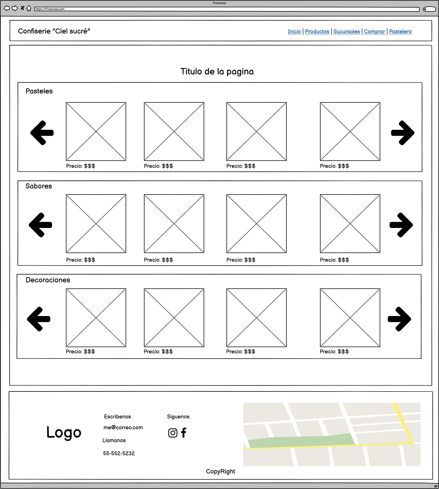
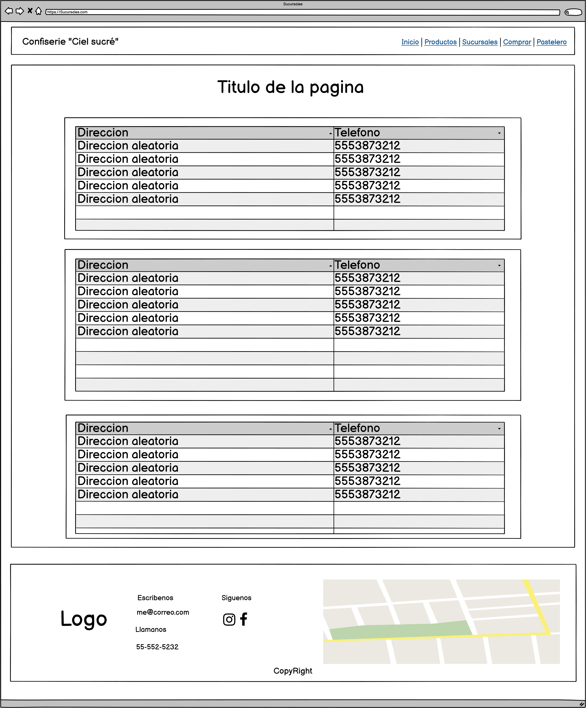
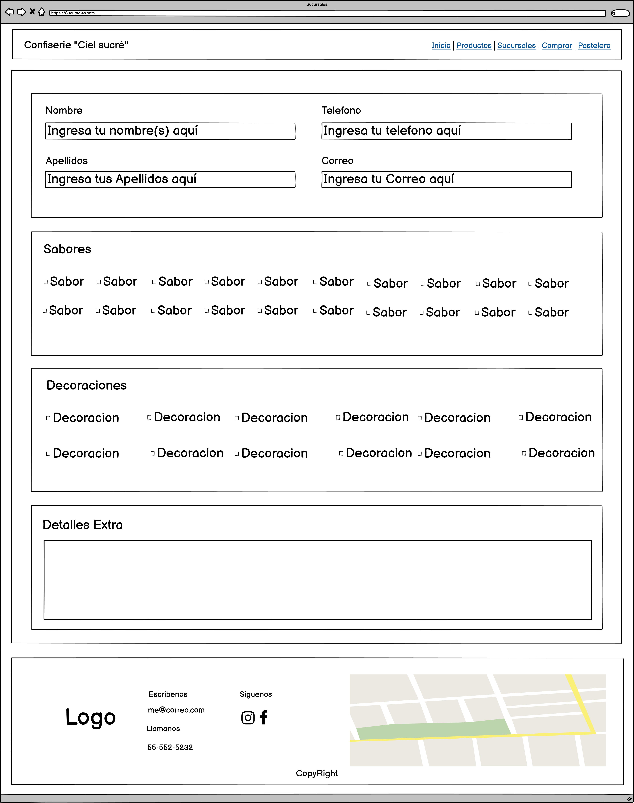
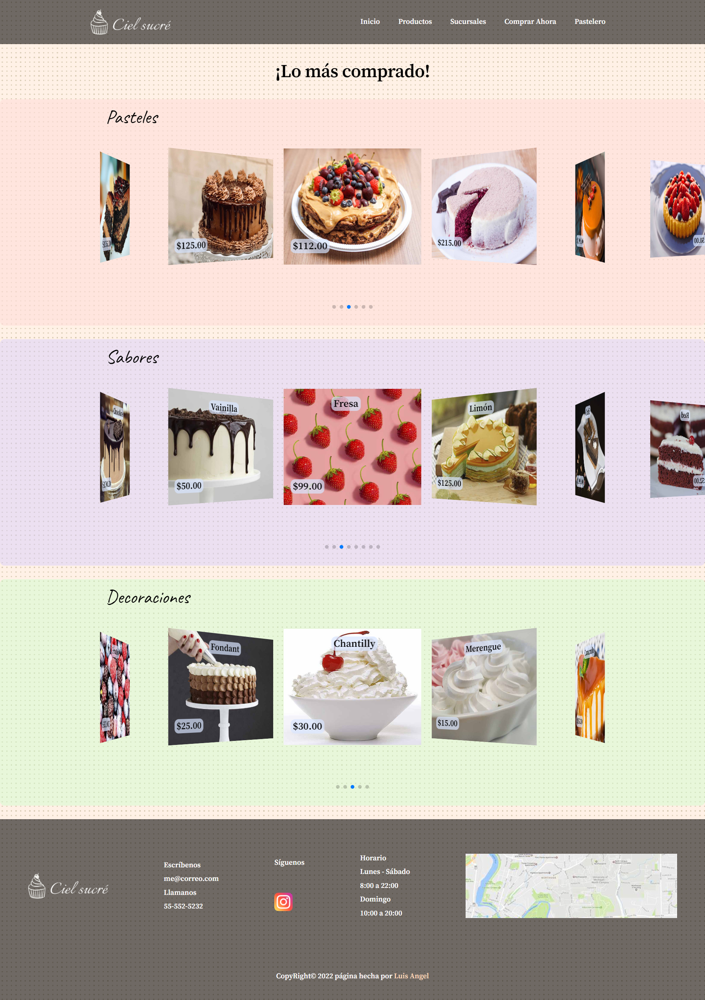
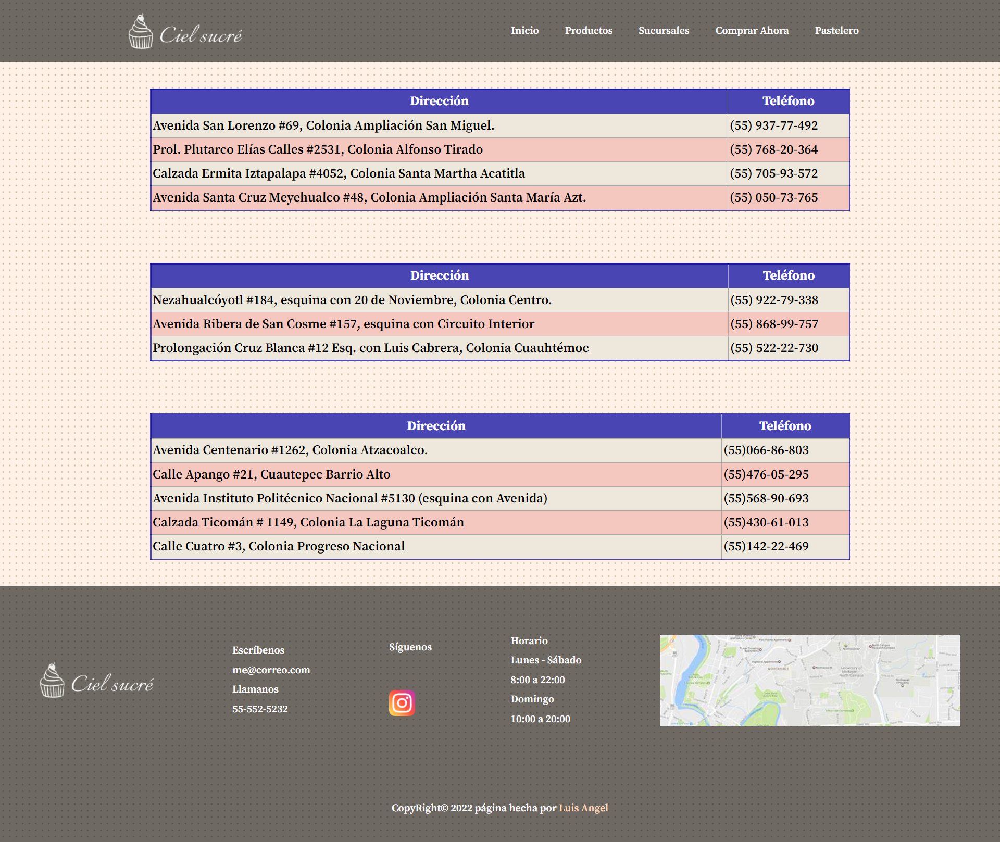
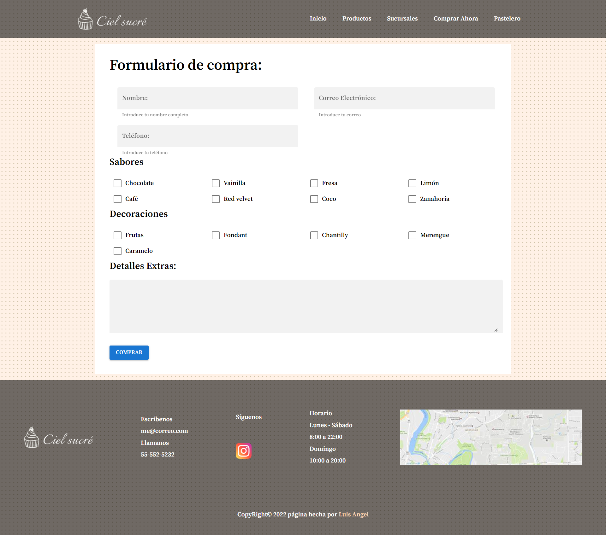
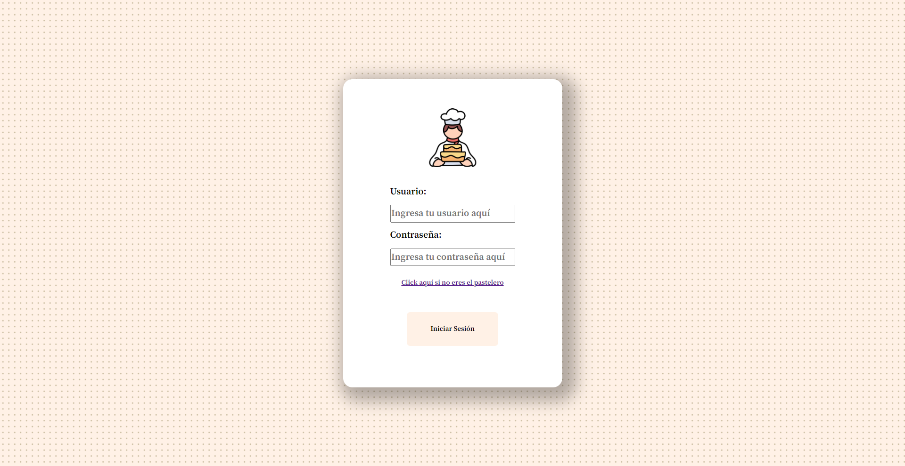
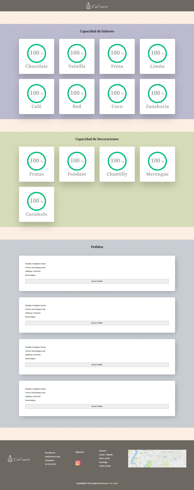

# Practica de pastelería realizada con Vue

## WireFrames

Para comenzar con este proyecto primero se hizo un análisis de requerimientos para que el proyecto tenga buenas bases, a continuación podrás ver los mockups con los que se comenzó la idea, pero si lo que quieres es ver la página desplegada puedes ingresar al siguiente link >>> <a href="https://polite-plant-09d293510.1.azurestaticapps.net/#/"> Soy el link </a> <<< la página esta pensada con un diseño responsive por lo que si estas en celular lo podrás ver. 


### 1. Vista de inicio
 
La idea principal para el home del usuario se basa en imágenes que le puedan ser atractivas al cliente y de esta manera tenga mas probabilidades de comprar uno de nuestros productos con tan solo ver el inicio de la aplicación


### 2. Vista de Productos

En esta vista colocamos la mayoría de productos con la finalidad de que si el cliente le interesaba nuestros productos podría verlos de manera organizada por pasteles, sabores y decoraciones junto con su nombre y precio.



### 3. Vista Sucursales

También me pareció importante agregar una sección en la cual las personas pudieran ver las direcciones de las sucursales en las cuales puedan adquirir los productos mostrados en esta página.



### 4. Vista del formulario de compra

Algo indispensable era un formulario en el que el cliente pudiera hacer su pedido, este formulario esta compuesto por una sección donde colocara nombre, correo, teléfono. Luego dos secciones donde podrá seleccionar sabores y decoraciones. Por ultimo una sección donde podrá agregar información extra de su pedido, como por ejemplo la descripción de un diseño especifico.



### 5. Vista de login

También se incorporo un login en el cual el pastelero ingresar para entrar a un apartado donde podrá ver datos personalizados.


### 6. Vista home del pastelero

Una vez que el pastelero iniciara sesión se debería desplegar información fundamental de los sabores, decoraciones y pedidos especiales que se han realizado.


## Diseño

A continuación se muestran los realizados en Figma antes de ser llevados a la programación

### 1. Vista de inicio


### 2. Vista de Productos



### 3. Vista de las sucursales



### 4. Vista formulario de compra



### 5. Vista Login 



### 6. Vista de inicio del pastelero



## Instalación local del proyecto

### Project setup
```
npm install
```

#### Compiles and hot-reloads for development
```
npm run serve
```

#### Compiles and minifies for production
```
npm run build
```

#### Lints and fixes files
```
npm run lint
```

#### Customize configuration
See [Configuration Reference](https://cli.vuejs.org/config/).
